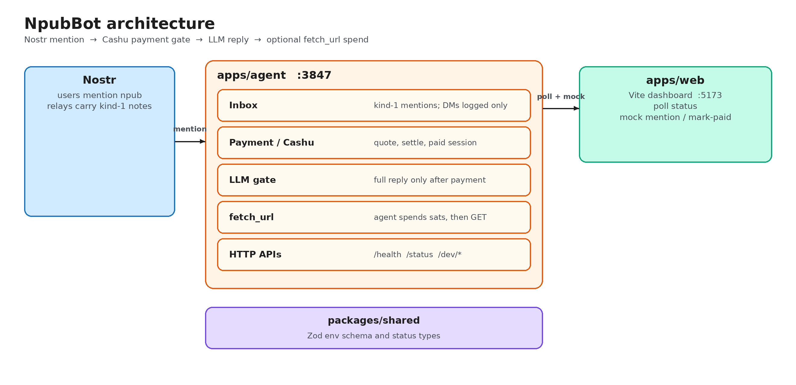

# NpubBot

NpubBot is a Nostr-native AI agent that gates full LLM replies behind a small Cashu payment (sats, with Lightning as the mint’s on/off ramp). Users mention the agent’s npub on relays. The agent can also spend sats from its own wallet to run one tool, `fetch_url`. A localhost Vite dashboard is an operator surface only.

## Overview

Talk to the bot on Nostr. Value is **Cashu** (ecash), not a custodial chat account:

1. An unpaid mention gets a **quote**, not an LLM answer. The prompt is held.
2. After payment settles, the held prompt is sent to an OpenAI-compatible LLM and a reply is published.
3. If the paid sender asks to fetch a URL, the **agent** spends `TOOL_SPEND_SATS` from its wallet, GETs the page, and folds the result into the reply.

Default configuration is **mock mode**: no relay sockets, no mint, no LLM key. Live Nostr and live Cashu are opt-in via environment variables.

The inbox loop turns relay, mint/wallet, LLM, tool, and balance failures into **user-facing replies**. It logs and continues; it does not take down the process.

## Architecture



Diagram source: [docs/architecture.excalidraw](docs/architecture.excalidraw) (open in [Excalidraw](https://excalidraw.com) or the VS Code Excalidraw extension).

| Package | Role |
| --- | --- |
| `apps/agent` | Inbox, payment gate, LLM, `fetch_url` spend, loopback HTTP (`/health`, `/status`, `/dev/*`) |
| `apps/web` | Dashboard: events, sessions, mark-paid / check mint, mock mention, tool spends |
| `packages/shared` | Shared TypeScript types and Zod env schema |

**Runtime path**

1. **Mention** — Live: kind-1 notes that tag the agent (`#p`). Mock: `POST /dev/inbound`.
2. **Paywall quote** — Unpaid senders get a Cashu quote. Extra unpaid mentions from the same pubkey are soft-throttled (`UNPAID_COOLDOWN_MS`). Paid traffic is not throttled.
3. **Payment settle** — Mock: dashboard **Mark invoice paid** or `POST /dev/mark-paid`. Live: mint bolt11 quote (polled every 5s) or a `cashuA` / `cashuB` token in a mention; dashboard **Check mint payment** forces a settle check.
4. **LLM reply** — Live: kind-1 note with `e` (reply) and `p` (sender) tags. Mock: signed locally; the HTTP/dev response includes the text.
5. **Optional tool spend** — Paid text with an `http(s)` URL routes to `fetch_url`. The agent pays from its own wallet (mock debit, or live Cashu melt), then GETs the URL. Lookup/search/fetch without a URL asks for a link (no spend). Insufficient balance returns a clear refusal.

Kind **4** and **1059** (legacy DM / NIP-17 gift wrap) are recorded, not decrypted. Mentions are the paid inbox.

## Repository layout

```
apps/agent       Agent process (Nostr inbox, Cashu, LLM, HTTP)
apps/web         Vite + React operator dashboard
packages/shared  Zod env schema and status payload types
docs/            Architecture diagram, MVP notes, demo/submit copy
```

## Prerequisites

- Node.js 22+
- [pnpm](https://pnpm.io) 10 (`corepack enable` then `corepack prepare pnpm@10.33.3 --activate`)

## Quick start

```bash
pnpm install
cp .env.example .env
pnpm dev
```

| Process | URL |
| --- | --- |
| Agent | http://127.0.0.1:3847/health and `/status` |
| Dashboard | http://127.0.0.1:5173 (polls the agent about every 1.5s) |

`pnpm typecheck` should pass after install.

`/dev/*` is served only when the agent binds loopback (`127.0.0.1`, `localhost`, or `::1`).

## Mock happy path

With `MOCK_MODE=true` (the default in `.env.example`):

1. Open the dashboard, or `POST /dev/inbound` with `{ "text": "hello" }`.
2. The agent replies with a Cashu **quote**, not an LLM answer. Wallet stays at `MOCK_BALANCE_SATS` (default 210).
3. Click **Mark invoice paid**, or `POST /dev/mark-paid` with `{ "quoteId": "…" }`.
4. The held prompt is sent to the (mock) LLM. A full reply is logged. Wallet **credits** `PAYMENT_GATE_SATS` (default 21) → 231.
5. Send a tool request from the **same sender** (`fetch https://example.com`). The agent **debits** `TOOL_SPEND_SATS` (default 10) → 221, GETs the URL, and the reply includes the page text (mock LLM echoes it). Dashboard **Tool spends** lists the debit. Live Cashu melts proofs instead of a mock debit (see [Live Cashu](#live-cashu)).

A second unpaid mention from the same pubkey within `UNPAID_COOLDOWN_MS` (default 10s) is **throttled** (no extra paywall, original prompt kept). Paid traffic is not throttled. The dashboard updates in place as `/status` changes.

```bash
curl -sS http://127.0.0.1:3847/dev/inbound \
  -H 'content-type: application/json' \
  -d '{"text":"what is npubbot?"}'
# copy quoteId and senderNpub from the JSON, then:
curl -sS http://127.0.0.1:3847/dev/mark-paid \
  -H 'content-type: application/json' \
  -d '{"quoteId":"QUOTE_ID"}'
# paid session: spend sats to fetch (must pass senderNpub)
curl -sS http://127.0.0.1:3847/dev/inbound \
  -H 'content-type: application/json' \
  -d '{"text":"fetch https://example.com","senderNpub":"SENDER_NPUB"}'
```

## Live Nostr

Set `MOCK_MODE=false` and `NOSTR_NSEC=nsec1…`. The agent connects to `NOSTR_RELAYS` with `nostr-tools` `SimplePool` and subscribes to:

- kind **1** mentions (`#p` = agent pubkey) — these enter the payment gate
- kind **4** and **1059** (legacy DM / NIP-17 gift wrap) — logged only

Replies are **kind-1** notes with `e` (reply) and `p` (sender) tags. If every relay publish fails, the dashboard still records the outbound note and shows a relay error; the loop keeps running.

Encrypted DMs are not decrypted (`TODO(nostr-dm-encryption)`). Mentions are the paid inbox. Mock Nostr (`MOCK_MODE=true` or no nsec) keeps the HTTP `/dev/inbound` path only.

## Live Cashu

`MOCK_MODE=true` **never** talks to a mint, even if `CASHU_MINT_URL` is set.

To flip:

1. `MOCK_MODE=false`
2. `CASHU_MINT_URL=https://testnut.cashu.space` (public FakeWallet test mint — invoices auto-mark paid; other mints need a real Lightning pay)
3. Leave `NOSTR_NSEC` and `LLM_API_KEY` empty to keep mock inbox + mock LLM while testing the mint
4. Restart `pnpm agent`

Live gate:

- **Quote:** `Wallet.createMintQuoteBolt11` → bolt11 in the paywall reply
- **Settle:** poll `checkMintQuoteBolt11` (5s) or dashboard **Check mint payment** → `mintProofsBolt11`
- **Receive:** a `cashuA` / `cashuB` token in a mention is `wallet.receive`'d (never logged)
- **Tool spend:** `createMeltQuoteBolt11` + `meltProofsBolt11`. `fetch_url` is a plain HTTP GET (no invoice), so the agent melts to a **mint-issued bolt11** for `TOOL_SPEND_SATS` and does **not** remint that quote. Sats leave the proof vault (plus Lightning/mint fees). Mock mode still uses an in-memory debit.

Proofs stay in process memory. `/status`, logs, and the dashboard never include nsec, API keys, or proofs.

`TODO(cashu-mint)`: persist proofs encrypted at rest across restarts.

If `loadMint` / quote / receive / melt fails, senders get a mint/wallet error string and the agent keeps serving `/health`.

## Scripts

| Script | What it does |
| --- | --- |
| `pnpm dev` | Agent + dashboard in watch mode |
| `pnpm agent` | Agent only |
| `pnpm web` | Dashboard only |
| `pnpm typecheck` | Typecheck all workspaces |
| `pnpm build` | Typecheck agent/shared and production-build the dashboard |

## Environment

Copy [`.env.example`](.env.example). **Do not put real nsecs or API keys in git.**

| Variable | Purpose |
| --- | --- |
| `MOCK_MODE` | `true` (default): mock inbox + mock mint + mock LLM |
| `NODE_ENV` | `development` (default), `test`, or `production` |
| `AGENT_HTTP_HOST` / `AGENT_HTTP_PORT` | Loopback status server (defaults `127.0.0.1:3847`) |
| `NOSTR_RELAYS` | Relays used when Nostr is live |
| `NOSTR_NSEC` | Agent secret (`nsec1…`). Empty → ephemeral mock identity |
| `CASHU_MINT_URL` | Mint URL used only when `MOCK_MODE=false` |
| `PAYMENT_GATE_SATS` | Admission amount before a full reply |
| `TOOL_SPEND_SATS` | What the agent pays from its wallet to run `fetch_url` |
| `TOOL_FETCH_TIMEOUT_MS` | Timeout for `fetch_url` |
| `MOCK_BALANCE_SATS` | Opening mock-wallet balance |
| `UNPAID_COOLDOWN_MS` | Soft-throttle extra unpaid paywalls per pubkey (`0` disables) |
| `SESSION_TTL_SECONDS` | Paid session lifetime |
| `QUOTE_TTL_SECONDS` | Unpaid quote lifetime |
| `SESSION_STORE_PATH` | JSON file for sessions (default `data/sessions.json` under `apps/agent`) |
| `LLM_API_KEY` / `LLM_BASE_URL` / `LLM_MODEL` | OpenAI-compatible client; mock if no key |
| `VITE_AGENT_BASE_URL` | Dashboard fetch base (`/agent` via Vite proxy) |

While `MOCK_MODE=true`, Nostr, Cashu, and the LLM stay mocked even if URLs or keys are set. With `MOCK_MODE=false`, each subsystem is live only when its credential/URL is present (`NOSTR_NSEC`, `CASHU_MINT_URL`, `LLM_API_KEY`).

## Security notes

- Bind the agent HTTP server to loopback. `/dev/inbound` and `/dev/mark-paid` exist only on loopback hosts.
- The HTTP API **never** returns the nsec, LLM keys, or Cashu proofs. String fields on `/status` are redacted if they look like those secrets.
- Live Cashu proofs are held in process memory only. Restarting the agent drops unsaved proofs until `TODO(cashu-mint)` lands.
- The dashboard is an operator tool on localhost. Users interact on Nostr.

## Plug-in points / TODOs

- `TODO(cashu-mint)` — persist proofs encrypted at rest (`apps/agent/src/payments/cashu.ts`)
- `TODO(nostr-dm-encryption)` — NIP-44 / NIP-17 decrypt so DMs can enter the gate

## Further docs

| Doc | Contents |
| --- | --- |
| [docs/TRACKS.md](docs/TRACKS.md) | Product intent (Cashu privacy, Nostr + ecash, agent earn/spend) |
| [docs/MVP.md](docs/MVP.md) | End-to-end loop and operator checks |
| [docs/DEMO.md](docs/DEMO.md) | Mock walkthrough and recording script |
| [docs/SUBMIT.md](docs/SUBMIT.md) | Short project copy |

## License

[MIT](LICENSE)
